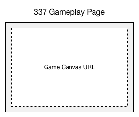
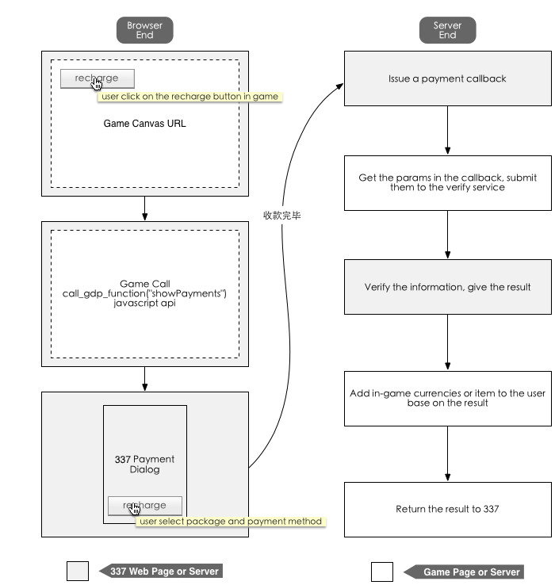

337.com Integration Guide
============================

.. _pre:

Definations
-----------------

Game developers need our help to set things up at our backend currently, there will be a "Secret Key" to secure almost every request from the game to 337 service.

Each game server will have a APPID like **GameName@Platform_language_Number**. For most of the time, game developer don't have to deal with this much. just need to know this is how we tell different servers in a single game.

.. _login:

Login
-----------

Developers need to offer us a **Canvas URL** for each game server (if the game want to use 337's multi-server feature), 337 will append necessary params to this url so that the game knows who the current user is.

Params appended
^^^^^^^^^^^^^^^^^^^^
+------------------+-----------+---------------+---------------------------------------------------------------------------------------------------------+
| Key              | requeired | type          | description                                                                                             |
+==================+===========+===============+=========================================================================================================+
| sig_app_id 	   | Y         | string        | appid of this server                                                                                    |
+------------------+-----------+---------------+---------------------------------------------------------------------------------------------------------+
| sig_api_key      | Y         | string        | apiID of this server, it will be the same as `sig_app_id`                                               |
+------------------+-----------+---------------+---------------------------------------------------------------------------------------------------------+
| sig_user         | Y         | string        | uid of the current user                                                                                 |
+------------------+-----------+---------------+---------------------------------------------------------------------------------------------------------+
| sig_username	   | Y	       | string        | username of the current user                                                                            |
+------------------+-----------+---------------+---------------------------------------------------------------------------------------------------------+
| sig_time         | Y	       | integer       | timestamp of this request sent.if this time is 5 minutes different from current time, drop this request.|
+------------------+-----------+---------------+---------------------------------------------------------------------------------------------------------+
| sig_flash_xml_url| N	       | string        | flash xml configuration file url, not needed.                                                           |
+------------------+-----------+---------------+---------------------------------------------------------------------------------------------------------+
| sig_auth_key	   | Y         | string        | signature of this request, how to generate this is described below.                                     |
+------------------+-----------+---------------+---------------------------------------------------------------------------------------------------------+
| sig_extended	   | N	       | string        | see :ref:`Login Extensions <loginextend>` for more information,this param will be signed separatly.     |
+------------------+-----------+---------------+---------------------------------------------------------------------------------------------------------+

How **sig_auth_key** generated
^^^^^^^^^^^^^^^^^^^^^^^^^^^^^^^^^^

::

    sig_auth_key = MD5.encrypt(sig_user + sig_app_id + sig_api_key + sig_time + secret);

secret will be provided by 337.

e.g. 337 will load the canvas like this：

::

    <iframe 
    id="iframecontent" scrolling="auto" frameborder="0" src="{游戏提供的URL}?sig_auth_key={sig_auth_key}&sig_user={sig_user}&sig_app_id={sig_app_id}&sig_api_key={sig_api_key}&sig_time={sig_time}&sig_username={sig_username}&sig_user_gender={sig_user_gender}&sig_src=&sig_flash_xml_url={sig_flash_xml}&connect_id={connect_id}" style="width:100%;">
    </iframe>

Example code in PHP：

::

    if(md5( $_GET[‘sig_user’] . $_GET[‘sig_app_id’] . $_GET[‘sig_api_key’] . $_GET[‘sig_time’] . $secret) !==  $_GET[‘sig_auth_key’]) {
        error_log(“Bad Signature”);
        return null;
    } else if((time() - (int)$_GET[‘sig_time’]) > 60 * 5) {
        // request should be issued in 5 minutes for example
        error_log(“Request Timeout”);
        return null;
    }

.. _loginextend:

Login Extensions
--------------------------------------

.. _payment:

Payment
----------

Client
^^^^^^^^^^^^^

On the user end, the game need to open the 337 payment dialog box using the JS function we provided, when user click on the recharge button. In order to do this, game need to implement our JS-SDK.

JS SDK
~~~~~~~~~~~~

JS SDK
JS-SDK gdp_jsproxy_client2.1.js requires JQuery and Swfobject，the resource for these libs are as below(use http or https version as you need)：

HTTP地址：

-  http://elex\_p\_img337-f.akamaihd.net/static/js/jquery.min-1.4.2.js
-  http://elex\_p\_img337-f.akamaihd.net/static/js/swfobject.js
-  http://elex\_p\_img337-f.akamaihd.net/static/js/common/gdp\_jsproxy\_client2.1.js

HTTPS地址：

-  https://elex-i.akamaihd.net/platform.elex-tech.us/static/js/jquery.min-1.4.2.js
-  https://elex-i.akamaihd.net/platform.elex-tech.us/static/js/swfobject.js
-  https://elex-i.akamaihd.net/platform.elex-tech.us/static/js/common/gdp\_jsproxy\_client2.1.js

The Functions
~~~~~~~~~~~~~~~~~~

With JS-SDK implemented, Game can access our javascript APIs by calling the Javascript function `call_gdp_function(funcName, params, callback)`.

Param List
~~~~~~~~~~~

+------------+--------------------------------------------------------------+
| Params     | Description                                                  |
+============+==============================================================+
| funcName   | API Name（required），for payment, it will be `showPayments` |
+------------+--------------------------------------------------------------+
| params     | API Param（optional），object type                           |
+------------+--------------------------------------------------------------+
| Callback   | javascript callback function name（optional）                |
+------------+--------------------------------------------------------------+

For the payment dialog, the follow code will be just fine:

::

    call_gdp_function("showPayments");

For the New Payment Flow, the function is:

::

    call_gdp_function("showBuyItem", {item_id: “item id defined on 337 console”});

Server-End integrations
^^^^^^^^^^^^^^^^^^^^^^^^^^

When user finishes a purchase, we will issue a server-end callback to the callback api game provide. Game can add in-game currencies or items to the user account base on the such callback.

The complete callback process will be as follow：

1. 337.com issues the callback notification with the payment information
2. Game receive this callback, get the information and submit the information to 337.com's payment verify service to check if the information is valid.
3. 337.com verifies the information, return the result.
4. Game deal with this payment based on the result of verification. if the verification is OK, add in-game currencies or items to this user account, and return **3,{user's uid}**,otherwise return the error.

Callback Params
~~~~~~~~~~~~~~~~~~

+----------------+----------------------------------------------------------------------------------+
| Param          | Description                                                                      |
+================+==================================================================================+
| trans\_id      | The id of this transition, duplicated transition id should not be proceed again. |
+----------------+----------------------------------------------------------------------------------+
| product_id     | if this payment runs in the new payment flow                                     |
+----------------+----------------------------------------------------------------------------------+
| amount         | the amount of the in-game currency user purchased                                |
+----------------+----------------------------------------------------------------------------------+
| user\_id       | user's id, as same as sig_user in SSO request                                    |
+----------------+----------------------------------------------------------------------------------+
| role\_id       | user's role id, if your game not using this, just ignore this.                   |
+----------------+----------------------------------------------------------------------------------+
| timestamp      | timestamp of this request issued                                                 |
+----------------+----------------------------------------------------------------------------------+
| gross          | the amount of real money the user paid.                                          |
+----------------+----------------------------------------------------------------------------------+
| currency       | the currency of real money the user paid, e.g. USD                               |
+----------------+----------------------------------------------------------------------------------+
| channel        | the payment method of this purchase, e.g. paypal                                 |
+----------------+----------------------------------------------------------------------------------+
| pay\_type      | payment type，web/mobile, can just ignore this.                                  |
+----------------+----------------------------------------------------------------------------------+
| vip            | if the user is 337.com vip and enjoy a discount.                                 |
+----------------+----------------------------------------------------------------------------------+
| custom\_data   | some customized data. if your game not using this feature, just ignore this.     |
+----------------+----------------------------------------------------------------------------------+

    -  **gross** is not accurate for some payment method, just use it as a reference.
    -  for some payment method，**gross** could be 0.
    -  for some payment method，337 will surcharge the user，which means user will have to pay more if they use these payment method, so please don't calculate how much in-game currency should add to user based on **gross** on your side，always use **amount**。

Verifications
~~~~~~~~~~~~~~~

337.com payment verify service url：https://pay.337.com/payelex/api/callback/verify.php

Public Key (.ca file, php may need this to work work properly),click to download：http://doc.xingcloud.com/download/attachments/4195503/verisign\_ca.crt?version=1&modificationDate=1327048502000

Request Method：POST/GET

Results may return：

-  OK： everthing is fine, the payment information is valid
-  other return value: this payment is invalid.

The Return value of the callbcak
~~~~~~~~~~~~~~~~~~~~~~~~~~~~~~~~~~~

+--------------------------------------+-----------------------------------------------------------+
| What game sould return               | Description                                               |
+======================================+===========================================================+
| 3,null                               | fail to proceed the payment on the game side.             |
+--------------------------------------+-----------------------------------------------------------+
| 3,94a0acb127ef8ee8c925e3944941ce5e   | the user doesn't exist                                    |
+--------------------------------------+-----------------------------------------------------------+
| 3,$user\_id                          | success, or this transition has already been proceed.     |
+--------------------------------------+-----------------------------------------------------------+

Example Code(PHP)
~~~~~~~~~~~~~~~~~~~~

::

    <?php
    $trans_id = $_REQUEST ["trans_id"];
    $user_id = $_REQUEST ["user_id"];
    $amount = $_REQUEST['amount'];
    $gross = $_REQUEST['gross'];
    $currency = $_REQUEST['currency'];
    $channel = $_REQUEST['channel'];

    ob_clean();
    //To check if the transaction exists in db.
    //Yes means the transactions has been successfully processed. Just return OK status
    $exist = is_trans_exist($trans_id);
    if($exist) {
        echo '3,'.$user_id;
        return;
    }

    //to verify the transaction towards payelex server.
    $res = check_payelex_transaction($trans_id, $user_id, $amount, $gross, $currency, $channel);
    if(!$res) {
        echo "3,null";
        return;
    }

    //retrieve the user from db.
    $user = find_user_from_db();
    if ($user == null) {
        echo '3,94a0acb127ef8ee8c925e3944941ce5e';
        return;
    }

    //recharge the user with the deserved game coins.
    if(add_coins($_REQUEST)) {
        echo '3,'.$user_id;
        return;
    }

    echo "3,null";

    function check_payelex_transaction($trans_id, $user_id, $amount, $gross, $currency, $channel) {
        $ch = curl_init();
        curl_setopt($ch, CURLOPT_SSL_VERIFYPEER, true);
        curl_setopt($ch, CURLOPT_SSL_VERIFYHOST, 1);
        //verisign_ca.crt is the public certificate from
        //VeriSign(It is the biggest Certificate Authority which issue XingCloud client certificate)
        //verisign_ca.crt must be located at the same directory as this PHP code are.
        curl_setopt($ch, CURLOPT_CAINFO, 'verisign_ca.crt');
        curl_setopt($ch, CURLOPT_HTTPHEADER, array("Content-Type: application/x-www-form-urlencoded"));
        curl_setopt($ch, CURLOPT_URL, 'https://pay.337.com/payelex/api/callback/verify.php');
        curl_setopt($ch, CURLOPT_POST, true);
        curl_setopt($ch, CURLOPT_RETURNTRANSFER, true);
        
        $params = array(
                'trans_id'=>$trans_id,
                'user_id'=>$user_id,
                'amount'=>$amount,
                'gross'=>$gross,
                'currency'=>$currency,
                'channel'=>$channel
        );
        
        curl_setopt($ch, CURLOPT_POSTFIELDS, http_build_query($params));
        
        $result = curl_exec($ch);
        curl_close($ch);
        $result = trim($result);
        if ($result === 'OK') return true;
        return false;
    }
